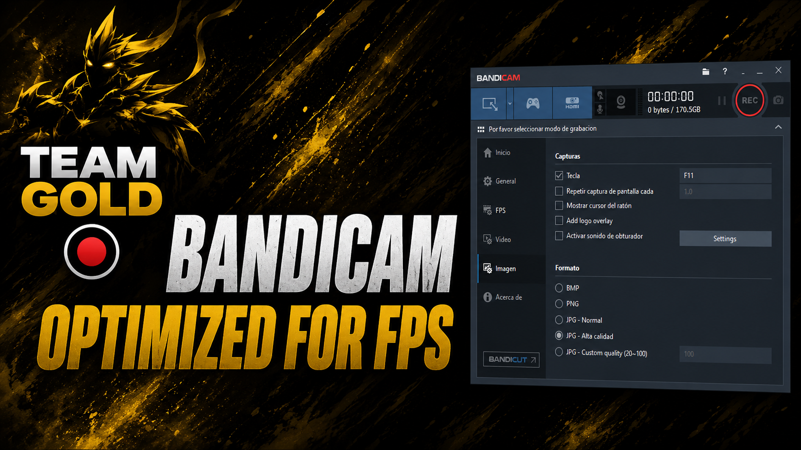

  

<h1 align="center">🎥 Bandicam Optimized for FPS</h1>

  High-performance Bandicam optimization package developed solely by <b>Mattqko</b> for <b>Team Gold</b>.

---

## ✨ Key Features

* ⚡ Optimized for maximum FPS performance.
* 🎮 Reduced input lag during gameplay recording.
* 📹 High-quality recording configuration.
* 🚀 Plug-and-play installation process.
* 🛡️ User-friendly setup with automatic extraction.
* 🔧 Designed for competitive and everyday use.

---

## 📦 Included Files

* `Bandicam Optimized by Team Gold.exe`
* `Preview.png`
* `README.md`

---

## 🛠️ Installation

1. Download `Bandicam Optimized by Team Gold.exe`.
2. Run the executable.
3. Allow the files to auto-extract automatically.
4. Open Bandicam.
5. Start recording using the optimized configuration.

**No additional setup required.**

---

## 🚀 What This Optimization Focuses On

* Stable FPS while recording.
* Reduced recording overhead.
* Smooth gameplay experience.
* High-quality video output.
* Fast and simple installation.

---

## 👤 Credits

### Original Optimization & Development

* **Mattqko / Matt** *(sole creator and developer of this optimization package).*

### Team

* **Created exclusively for Team Gold.**

---

## ⚠️ Disclaimer

This project is provided as-is for educational and personal use. Users are responsible for ensuring compliance with the software licenses applicable to their environment.

---

## 📜 Version

**Bandicam Optimized for FPS — Official Release**

Made with dedication for **Team Gold** 🏆
